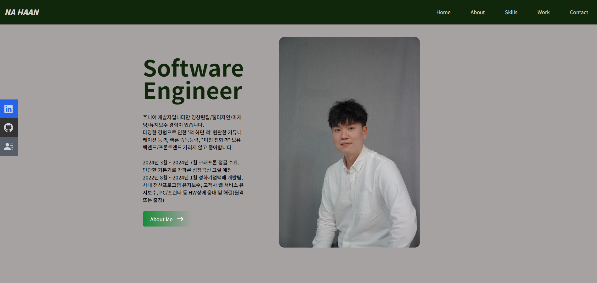

# React Personal Portfolio



## Description:

A personal portfolio website built using React, showcasing my skills, projects, and experiences. This portfolio is designed to highlight my expertise in web development and provide visitors with an overview of my professional background.

## Netlify Link

https://nahaan.site/

## Technology:

Project is created with:

- Javascript
- Node.js
- Express.js
- Mongoose
- Tailwind
- Postcss

## Installation

To run this project, install it locally using npm:

```
git clone
npm install
```

## Usage

After installing npm packages, the application will be invoked by using the following command:

```
npm start
```

